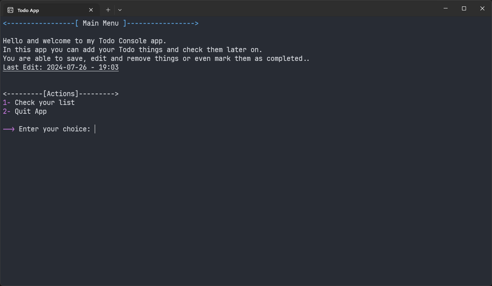

# Todo Console App

## Description
The Todo Console App is a console-based application written in C#. It was developed as a learning exercise while I was a beginner in C# programming. The application allows users to manage their todo lists via the console.

## Features
- **Add Todo Items:** Users can add new todo items to their list.
- **Edit Todo Items:** Users can update existing todo items.
- **Remove Todo Items:** Users can remove specific todo items from their list.
- **Mark as Completed:** Users can mark todo items as completed.
- **View Todo List:** Users can view all their todo items, with completed and important items highlighted.
- **Data Persistence:** All user data and changes are saved persistently.

## User Interaction
Users interact with the application through the console by entering specific action numbers. The following actions are available:
- **Add New Todo:** Add a new item to the todo list.
- **Update Todo:** Edit an existing item on the todo list.
- **Remove Todo:** Delete an item from the todo list.
- **Remove All Todos:** Clear the entire todo list.
- **Mark as Important:** Highlight an item as important.
- **Mark as Completed:** Mark an item as completed.
- **View Todo List:** Display the current list of todo items.
- **Quit App:** Exit the application.

## Technologies Used
- **Programming Language:** C#
- **Environment:** Console Application

## Getting Started
To get started with the Todo Console App, follow these steps:
1. Clone the repository to your local machine.
2. Open the solution file in Visual Studio.
3. Build and run the application.
4. Follow the on-screen instructions to manage your todo list.

## Screenshots

## Future Improvements
- Add a graphical user interface (GUI) for a better user experience.
- Implement additional features such as reminders and due dates.
- Enhance data persistence with a database backend.

## Contributing
If you would like to contribute to this project, please fork the repository and submit a pull request.

## License
This project is licensed under the MIT License.
